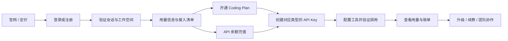
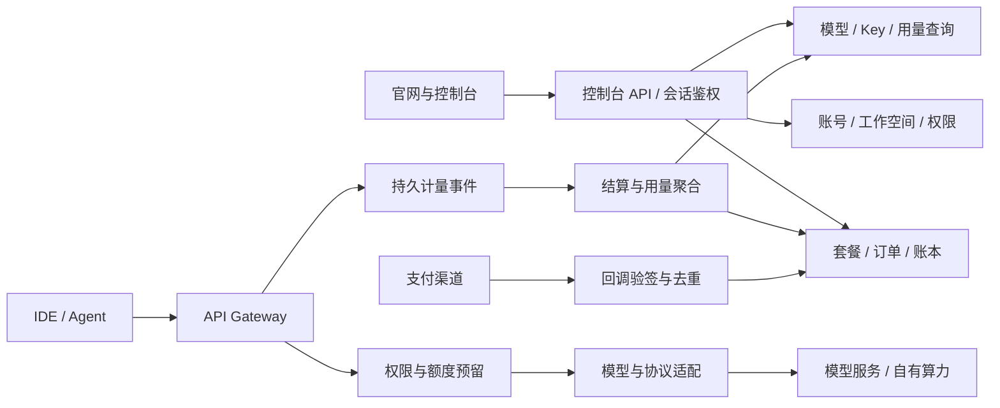

# FormSy 控制台与 Coding Plan 完整方案

日期：2026-09-07 · 版本：v0.1 · 状态：待评审的产品与实施方案

目标：接通官网、注册登录、Coding Plan、模型 API 与企业能力，形成从了解产品、开通服务到持续使用的完整路径。本文件描述规划，未表示后台、计费或模型服务已经上线。

## 1. 核心定位与本版结论

AURINOVA 是品牌，FormSy 是产品。官网负责产品理解与购买决策，控制台负责接入、额度、使用与结果管理。

建议先交付面向开发者的自助控制台：**用量信息、Coding Plan、模型、API Keys、工具接入、费用中心、账号设置**。让用户可以完成“注册 → 开通套餐或充值 → 创建 Key → 配置工具 → 发起调用 → 查看用量与账单”。

企业能力接在同一个工作空间体系下：团队、任务与验证、上下文资产、部署。Context Compute 与 Workload Intelligence 的产品主线延续到后台，后续有真实任务证据时，再展示任务完成率与成功任务成本。

本版采用的方案假设：

- 首期服务个人开发者；数据模型预留工作空间与项目，团队协作在下一阶段开放。
- Coding Plan 为订阅产品，API 按量服务为余额产品；各自有独立 Key 类型、用量与扣费规则。
- 套餐额度建议使用可解释的加权 Token 点数，辅以短周期用量上限和并发限制；最终数值待成本压测确认。
- 官网与控制台共用账号与语言设置。生产账号、余额和权益以服务端为准。
- 保留现有登录注册界面与官网骨架，本轮交付方案文档，不新增可购买的虚拟套餐。

## 2. DeepSeek 参考范围

本次通过浏览器查看了用户提供的 [DeepSeek 用量页](https://platform.deepseek.com/usage)。已观察到的结构包括：左侧用量信息、API keys、充值和账单；底部文档、帮助、定价与个人入口；主区域的余额／累计消费、日期与 Key 筛选、导出、消费／请求／Token 指标和趋势图。页面还展示时区、数据延迟说明以及按模型或 Key 查看图表的入口。

借鉴其轻量侧栏、清晰费用入口和用量优先的信息层级。保留 AURINOVA 品牌蓝与现有字体、直角结构。未逐项操作其付款、Key 管理、账单和账号流程；这些页面的详细行为在下文作为 FormSy 设计建议，不声称复刻 DeepSeek。

DeepSeek 官方价格文档将输入、缓存与输出 Token 分项计费，并区分赠送余额与充值余额；这为 FormSy 的按量账本提供参考。[官方模型与价格](https://api-docs.deepseek.com/quick_start/pricing/)

其官方限流文档按账号计算模型并发，明确多个 API Key 不会各自增加账号总并发。FormSy 同样需要在工作空间总额下约束成员和 Key。[官方限速与隔离](https://api-docs.deepseek.com/zh-cn/quick_start/rate_limit/)

以上不引入 DeepSeek 具体价格、赠送额度、并发数或服务承诺。文档与演示使用自有测试数据，不保存参考账号的余额、账单或凭据。

## 3. 现有项目与缺口

| 模块 | 代码中的现状 | 后续处理 |
| --- | --- | --- |
| 官网 | `/aurinova-reference` 已有双 Banner、能力、学习闭环、部署、场景与合作区块 | 保留，增加 Coding Plan 和模型库入口 |
| 定价 | `/aurinova-reference/pricing` 当前展示试点、企业、产业合作 | 扩展为 Coding Plan、API 按量、企业方案三类 |
| 旧版模型与定价 | Git `da9627d` 保留模型卡片、Token 价格、训练与 GPU 部署定价结构 | 借用展示结构；模型名称、价格与上线状态重新配置 |
| 认证页面 | 登录、注册、邮箱登录、第三方登录、SSO、找回密码请求及预览模式 | 复用表单与错误状态；补验证邮箱、密码重设落地与会话完整闭环 |
| 认证适配 | `lib/auth/api.ts` 接外部服务，含凭证 Cookie、返回地址校验 | 服务端能力尚不能从前端代码认定；补 session、logout、回调与权限接口 |
| 登录返回 | `lib/auth/redirect.ts` 默认返回官网 | 控制台就绪后默认返回 `/console/usage`，保留安全的原始目标 |
| 路由 | `src/router.tsx` 静态注册公开页面；没有受保护控制台路由 | 增加控制台布局、会话守卫及参数路由能力 |
| 商业后台 | 本仓库未见 Key、网关、订阅、支付、账本、任务后端实现 | 单独建设服务端，前端通过正式接口读取 |
| 国际化与设计 | 类型化中英文字典、共享 UI、品牌蓝、响应式 | 控制台继续复用，不另建一套视觉体系 |

认证当前在配置不完整时进入预览模式。预览操作不会创建真实账号或会话；将来独立的控制台演示也不能赋予真实权益。上线条件沿用并扩展 [认证接口文档](auth-api.md)。

## 4. 官网、登录与控制台的连接

### 4.1 官网菜单

| 位置 | 调整后的内容 |
| --- | --- |
| 产品 | FormSy 平台、Coding Plan、Context Compute、Workload Intelligence |
| 解决方案 | AI 软件工程、企业 Agent、推理优化、产业合作 |
| 模型与部署 | 模型库；保留现有六类模型与部署选项 |
| 方案与定价 | Coding Plan、API 按量计费、企业方案 |
| 资源 | 接入文档、使用指南、验证方法、更新 |
| 右上角未登录 | 语言、登录、注册 |
| 右上角已登录 | 语言、进入控制台、账号菜单 |

原“查看合作方式”继续放在企业方案、首页合作区和相关 CTA。登录注册入口持续保留，不因试点型内容再次隐藏。

建议新增 `/aurinova-reference/coding-plan` 和 `/aurinova-reference/models`；当前定价 URL 保持可用。旧版完整训练价目表与 GPU 价目表等到对应服务真实可售后再开放。

### 4.2 注册与登录规则

1. 官网登录默认目标为 `/console/usage`；从定价进入时，保留 `plan_id` 对应的待选方案意图，登录后先展示订单确认。
2. 未登录访问控制台时进入现有登录页，使用现有 `return_to` 参数承接安全站内路径。合法原路径优先于默认地址。
3. 首次登录在服务端幂等创建个人工作空间和默认项目；只询问必要信息，避免重复注册和重复创建空间。
4. 开通、充值、生成正式 Key 前，账号须满足已验证邮箱等服务端条件。OAuth 以提供方声明为依据；同邮箱身份绑定需要已登录会话或二次验证。
5. 新用户进入用量页后显示接入清单；已有用户直接看到最近工作空间的用量。
6. OAuth／SSO 的回调由身份服务处理，前端查询会话后进入目标页。过期状态、回调错误和组织不匹配均有可重试页面。
7. 会话失效保留当前站内目标，回到登录；退出清除客户端私有查询缓存，由服务端撤销会话。
8. 用户语言延续官网设置，登录后可同步到个人资料；货币与语言独立。

## 5. 控制台信息架构

“管理后台”在此包含客户使用的控制台，以及独立的内部运营台。客户侧默认落到用量页，首期不再额外增加重复的“总览”菜单。

| 分组 | 菜单 / 英文名 | 建议路由 | 内容 | 阶段 |
| --- | --- | --- | --- | --- |
| 使用 | 用量信息 / Usage | `/console/usage` | 套餐额度、余额、趋势、明细 | 首期 |
| 使用 | Coding Plan | `/console/coding-plan` | 当前套餐、购买、周期、升级与续费 | 首期 |
| 使用 | 模型 / Models | `/console/models` | 可用模型与权益、能力、价格、限制 | 首期 |
| 接入 | API Keys | `/console/api-keys` | 创建、限制、停用、撤销 | 首期 |
| 接入 | 工具接入 / Integrations | `/console/integrations` | 工具配置、示例、连接检查 | 首期 |
| 费用 | 余额与充值 / Balance | `/console/billing/balance` | 现金与赠送余额、充值记录、提醒 | 首期 |
| 费用 | 订单与账单 / Billing | `/console/billing/orders` | 套餐订单、充值订单、账单、退款进度 | 首期 |
| 管理 | 账号设置 / Settings | `/console/settings` | 个人资料、安全、会话、通知、语言 | 首期 |
| 管理 | 团队与项目 / Workspace | `/console/workspace` | 成员、项目、预算与权限 | 第二期 |
| 工作 | 任务与验证 / Tasks | `/console/tasks` | 任务执行、证据、Finish Gate | 第三期 |
| 工作 | 上下文资产 / Context | `/console/context` | 数据源、版本、规范与复用 | 第三期 |
| 工作 | 模型与部署 / Deployments | `/console/deployments` | BYOM、BYOC、私有环境、容量 | 第三期 |
| 辅助 | 文档、帮助、服务状态 | 配置真实目标 | 固定在侧栏下部 | 首期 |

模型详情、订单详情、任务详情使用参数路由；本地参数化路由与生产深链回退需一起实现。未建设的工作模块首期不在侧栏展示空入口。

## 6. 关键页面内容与交互

### 6.1 用量信息

主区域从上到下：

| 区域 | 展示与行为 |
| --- | --- |
| 页面头 | 当前工作空间、时间范围、时区、最后更新时间及延迟说明 |
| 账户摘要 | 当前 Coding Plan、月额度余额、短周期剩余额度与重置时间；API 可用余额和充值动作 |
| 新用户引导 | 选择服务 → 开通或充值 → 创建 Key → 配置工具 → 首次调用；按服务端完成状态勾选 |
| 筛选条 | Coding Plan／按量 API、日期、模型、API Key；团队开放后增加项目与成员 |
| 核心指标 | Plan 页签：消耗点数、请求数、输入／输出 Token、API 成功率；API 页签：计费金额、请求数、Token、API 成功率 |
| 趋势图 | 点数或金额、请求和 Token 使用独立单位；按模型或 Key 拆分；悬停可看实际数值 |
| 明细表 | 时间、请求 ID、模型、Key 尾号、计费来源、Token 分项、点数／金额、状态、时延 |
| 导出 | 导出当前筛选范围；大结果异步生成，带单位、时区与账单状态 |

首页账户摘要始终标记“当前周期／当前余额”；下面图表与指标标记所选时间范围，防止不同周期混算。点数、货币、Token 分列，套餐费用不会在每次调用时重复计入按量消费。

无数据时展示“尚无调用”及接入入口；读取失败展示重试；聚合延迟展示更新时间。余额与可调用额度由实时权益服务返回，不依赖可能延迟的统计图表。

### 6.2 Coding Plan

- 已开通：套餐名称、周期起止、付款状态、续费方式、点数用量、短周期额度、并发上限、可用模型、已关联 Key。
- 未开通：方案比较、包含权益、使用范围、限制、价格与购买动作；未确定价格的环境显示演示状态并关闭真实购买。
- 权益：模型清单、协议与工具兼容范围、上下文和输出上限、点数计算说明、超额处理、支持渠道。
- 操作：购买、到期续费、升级、预约降级、取消续费、查看订单。取消续费与立即退款分开。
- 场景：额度接近上限时提醒；耗尽时给出重置时间、升级或切换到用户自行配置的按量 Key 的入口。

### 6.3 模型

恢复旧版“模型库”的可浏览性。卡片先展示名称、任务适用范围和可用状态；详情展示上下文上限、输出上限、工具调用、流式输出、缓存支持、协议、计量规则与配置示例。

状态分为：当前可用、套餐未包含、待开放、临时不可用。可用性取自模型注册表，模型列表与网关授权使用同一来源。

Plan 点数倍率和 API 单价分栏。用户手动选定模型时保持选择；若以后开放自动路由，需要说明模型池、质量策略与实际调用模型。不同模型的故障切换仅在明确授权的策略内发生。

### 6.4 API Keys

每个 Key 归属固定工作空间、项目和计费来源：`coding_plan` 或 `metered_api`。创建时明确类型；前缀可以便于用户辨认，服务端记录决定实际权限。

创建表单包含名称、模型权限、有效期、项目和可选预算限制。Plan Key 可设置点数子预算，API Key 可设置金额子预算，两者均服从工作空间总上限。

创建后完整密钥仅展示一次；服务端保存可验证的哈希和尾号，列表只展示尾号、状态、最近使用与预算。支持停用、恢复、撤销与轮换，撤销后旧 Key 不再接收新请求；已经开始的请求按完成用量结算。任何操作不能读取上游服务商密钥。

### 6.5 工具接入

首期以“经过验证的工具 + 经过验证的协议”为展示边界。候选验证对象可覆盖 Cline、Roo Code、Claude Code、Codex CLI 等，但在验证前不标注已支持。

用户选择工具 → 选择可用模型 → 选择 Key 类型 → 复制 Base URL／模型 ID／配置模板 → 在本地填写 Key → 发起测试 → 在用量页确认请求。

协议分别记录 Chat Completions、Responses、Anthropic Messages 的支持情况。实现其中一种不能自动宣称兼容另外两种；协议缺失时提供明确说明。

控制台内连接诊断通过受保护的服务端诊断接口执行，无需回读 Key 明文。每个工具的验收包含流式输出、工具调用、取消、长上下文、错误码和额度耗尽；每次测试显示是否消耗额度。

### 6.6 余额、订单与账单

余额页分别展示现金余额、赠送余额、冻结金额和可用余额；赠送余额显示有效期。充值金额、币种、订单状态与付款主体在确认页展示。

订单与账单区区分：套餐购买／续费／升级订单、API 充值订单、API 消费账单。账单记录价格版本、统计周期和调整项，提供下载与争议定位所需请求 ID。首期提供订单和消费明细；税务发票能力根据实际支付主体及服务接入开放。

支付回跳只用于恢复页面，权益由已验证的支付结果生效。未支付、处理中、成功、关闭、失败、部分退款、全额退款均有明确状态；重复回调不得重复充值或开通。

### 6.7 账号、团队与支持

账号设置含显示名称、验证邮箱、登录方式、改密、会话列表、退出其他设备、语言、时区和通知；不在 URL 或前端持久存储保存会话密钥。

首期个人空间提供 Owner 权限；第二期加入团队邀请、项目、角色和成员预算。工作空间切换后清除旧空间的缓存和筛选，不跨空间汇总费用。

帮助入口支持携带用户主动选择的请求 ID 创建工单；默认不附提示词、代码或完整输出。服务状态按自有服务真实状态展示。

## 7. Coding Plan 产品与定价设计

### 7.1 套餐结构建议

| 方案（暂名） | 用户 | 权益重点 | 首次开放 |
| --- | --- | --- | --- |
| Starter | 个人日常使用 | 基础模型池、月额度、单人接入 | 首期 |
| Pro | 高频开发者 | 更高额度／并发、扩展模型池 | 首期 |
| Team | 研发团队 | 席位、共享额度、成员预算、团队账单 | 第二期 |
| Enterprise | 企业平台与私有部署 | SSO、数据边界、专属容量和协议交付 | 延续企业合作入口 |

首期以月付为主，避免同时引入年付、加油包、复杂促销和跨套餐余额折算。试用额度可配置，但未建立滥用成本与验证机制前不承诺免费赠送。

定价页每档必须展示：金额与币种、计费周期、含税表达、可用模型、月点数、短周期点数、并发、超额规则、续费方式、取消规则。金额与额度不得仅由前端写死。

### 7.2 点数与限额规则

建议以加权 Token 点数做结算主单位。后台保留输入未缓存、缓存输入、输出的实际 Token 数，再按选定模型的版本化倍率转换点数：

`点数 = (未缓存输入 Token × 输入倍率 + 缓存输入 Token × 缓存倍率 + 输出 Token × 输出倍率) / 点数基准`

倍率与点数基准在模型详情和购买说明中公开。缓存 Token 不得同时重复计入未缓存输入；推理 Token 如已含在输出统计中，不再次叠加。计算保留固定精度，展示层才做格式化。

“月额度 + 短周期限制 + 并发限制”同时校验；短周期建议先采用固定窗口，记录服务端起止时间。具体窗口时长、额度及模型倍率待压测后确认，接口支持配置。切换展示时区不能重置额度；增加 Key 不增加账号总额度。

避免把一次 API 请求命名为一次完整编程任务。编程工具的多轮调用、工具执行与重试都会影响消耗，实际值在用量页透明展示。首期不按“任务成功数”收费。

### 7.3 Plan 与按量服务的边界

| 情况 | 默认行为 |
| --- | --- |
| Plan Key，模型在套餐内、额度足够 | 只扣套餐点数，不扣现金余额 |
| Plan Key，额度用完或短周期达到上限 | 返回额度错误和重置时间，停止新的调用 |
| Plan Key，模型不在套餐内 | 返回模型权限错误，引导查看可用模型 |
| API Key，余额足够 | 按版本化 API 单价从可用余额结算 |
| API Key，余额不足 | 拒绝新请求，提供充值入口 |
| 已订阅套餐但使用 API Key | 仍按量结算，创建和接入界面明确提示 |
| 套餐到期但 API 钱包还有余额 | Plan Key 停止新增调用；API Key 可独立使用 |

首期不做自动跨来源扣费。将来若开放 Plan 超额自动转 API，必须由用户主动开启、设金额上限，并明确本次调用的计费来源。

### 7.4 生命周期与退款

- 支付确认后激活套餐与周期，失败支付不授予额度。周期以服务端精确时间为准，显示下次重置和到期时间。
- 首期允许手动续费；只有支付渠道支持且用户明确选择时启用自动续费。取消续费保留当前周期权益。
- 升级建议立即生效、保留原周期，按剩余周期给出差价与新增额度报价，展示订单确认后执行；多次升级不得重置历史已用额度。
- 降级从下个周期生效；额度不跨周期结转作为本版默认建议，并写入购买说明。
- 续费失败时通知用户，在已付款周期结束后停止 Plan 新请求；不自动扣 API 钱包补缴订阅。
- 退款使用关联原订单的冲正记录，保留既有用量账本；限制未使用权益。具体可退范围与支付渠道、正式条款统一后发布。

最终价格需覆盖模型采购／推理、缓存、网关、支付、支持成本，并用高用量与高成本模型组合压测毛利。渠道可售范围与模型使用授权在开放购买前确认。

## 8. 任务价值与现有 FormSy 能力的落点

| 官网能力 | 后台功能 | 开放条件 |
| --- | --- | --- |
| Context Compute / Builder | 接入代码、文档与 CI，构建任务上下文包 | 数据源连接器、权限与版本后端 |
| Runtime / Finish Gate | 任务状态、验证标准、证据与完成判定 | 真实任务／运行事件与验证器 |
| Warehouse / 学习闭环 | 规范、技能、策略资产，来源追踪与复用 | 版本、审核、权限、归档机制 |
| Workload Intelligence | 模型选择、成本归因、路由与容量观察 | 网关计量、模型注册表、成本数据 |
| 企业部署 | BYOM、BYOC、Edge / VPC 和专属容量 | 实际部署连接与健康检查 |

第三期任务详情以 `task → runs → requests → evidence` 关联数据，记录上下文版本、执行尝试、验证规则版本、结果与成本。按相同任务范围统计已结束任务的验证通过率，同时展示取消、失败和未知状态。

“成功任务成本”建议定义为：同一统计任务集合中全部执行尝试的可归因成本（含失败与重试）÷ 通过验证的任务数。无已验证任务时显示“暂无可计算数据”。订阅付费、额度点数、归因推理成本分项展示，不将其混为同一金额。

首期只有 API 网关时只展示请求成功率、时延和 Token；任务验证率与企业资产沉淀保持未开放状态。参考首屏趋势图继续标明概念示意。

## 9. 角色、隔离与运营后台

| 动作 | Owner | Admin | Developer | Billing | Viewer |
| --- | --- | --- | --- | --- | --- |
| 查看空间汇总 | 全部 | 全部 | 授权项目 | 财务用量 | 授权汇总 |
| 创建／管理 Key | 全部 | 全部 | 个人及授权项目范围 | 无 | 无 |
| 购买、续费、充值、账单 | 有 | 查看状态 | 查看自身额度 | 有 | 无 |
| 邀请与项目权限 | 有 | 有，不能授予 Owner | 无 | 无 | 无 |
| 移交空间、关闭空间 | 有 | 无 | 无 | 无 | 无 |
| 任务内容与证据 | 按项目授权 | 按项目授权 | 按项目授权 | 无 | 显式只读授权 |

所有接口在服务端验证工作空间成员与对象权限。Key ID、项目 ID 或前端隐藏菜单均不能替代授权。只有 Owner 可移交所有权和分配财务角色；关键管理动作保留审计记录。

内部运营台建议独立 `/ops` 或独立站点，只向员工身份开放，使用独立权限与强认证。生产售卖前至少具备：用户与空间检索、模型上下线与价格版本、套餐配置、订单查询、支付回调状态、用量核对、冻结与解冻、额度调整和工单。

退款与手工调账需要原因、操作者、原订单和不可变审计；首期可通过受控内部工具处理。客服角色不能直接修改财务账本或查看用户 Key 明文。公开控制台不出现运营入口。

## 10. 服务架构与数据模型

保持现有 Vite 前端；新增服务端承担身份、权益、支付、Key 与计量。建议首期采用模块化业务后端，网关独立承接推理流量，避免先拆出大量服务。

建议基础设施：关系数据库保存权威业务与账本；Redis 等服务维护限流与短期缓存；持久队列或事务 outbox 承载计量／支付事件。技术选型可沿用后续后端团队的现有栈。缓存不独立承担余额真相。

| 实体 | 关键数据与边界 |
| --- | --- |
| User / Identity / Session | 身份来源、邮箱验证、会话有效期与撤销 |
| Workspace / Membership / Project | 归属、角色、项目范围；个人也拥有默认空间 |
| Model / Provider / PriceVersion | 实际模型、协议、上游配置引用、价格与倍率的生效时间 |
| Plan / PlanVersion / Subscription | 权益、周期、取消状态、版本快照 |
| ApiKey | 哈希、尾号、归属、模型权限、计费类型、有效期 |
| QuotaPeriod / Reservation | 周期额度、已用、预留、有效边界及并发关联 |
| UsageEvent / UsageAggregate | 请求 ID、来源、实际模型、Token、状态、时间、计费版本；可选 task/run ID |
| Wallet / LedgerEntry | 币种、可用／冻结余额、收入、扣款、释放、冲正；单条记录不可随意覆盖 |
| Order / Payment / Refund | 订单用途、报价快照、渠道事件、实际支付与退款状态 |
| AuditEvent / ExportJob | 管理动作、导出权限、过期时间 |
| Task / Run / Evidence / ContextVersion | 第三期增加，保持空间与项目隔离 |

资金字段使用定点数或最小货币单位；点数独立字段。首期一个钱包只用一种结算币种，不在语言切换时自动换汇。

### 10.1 请求与结算链路

1. 验证 Key、空间状态、模型权限、总额度与并发；按输入与最大输出估算费用或点数，原子预留可用额度。
2. 调用模型并记录稳定请求 ID。单次请求绑定计费来源、价格／套餐版本、开始时所属额度周期。
3. 流式或非流式完成后，持久化实际用量，结算预留差额、释放剩余额度和并发槽。
4. 同一计量事件重复投递不重复入账；并发请求的可用额度检查和预留必须原子执行。
5. 用户取消或流中断时，已实际生成部分按明确规则结算；用量未知时标记待核对并异步对账，不直接归零或释放全部后继续透支。
6. 鉴权失败、额度拒绝、参数校验失败且未进入推理时不扣使用额度。平台内部重试聚合到原请求结算记录，避免向客户重复收费；客户端主动重发产生新请求时按新调用处理。
7. 周期切换后，旧请求结算到原预留周期，新请求使用新周期；撤销 Key／取消续费不会抹掉已发生用量。
8. 上游成本与客户应付分账，定期核对订单、支付、额度与聚合报表；提供可审计冲正。

## 11. 建议 API 合同

保留已有 `/api/auth/*` 协议，以下为新增建议。业务接口需正式后端实现；名称可在实施前调整。

| 接口 | 用途 |
| --- | --- |
| `GET /api/auth/session`、`POST /api/auth/logout` | 读取会话／空间摘要与退出 |
| 邮箱验证、密码重设完成、OAuth／SSO 回调 | 补完整身份流程，Token 一次使用并过期 |
| `GET /api/console/workspaces` | 查询可访问空间 |
| `GET /api/console/workspaces/:id/usage` | 指标与趋势；返回时区、更新时间和计量来源 |
| `GET /api/console/workspaces/:id/usage/requests` | 游标分页的请求明细 |
| `POST /api/console/workspaces/:id/exports` | 授权导出任务 |
| `GET /api/console/models`、`GET /api/console/plans` | 版本化商品与模型信息 |
| `GET /api/console/workspaces/:id/subscription` | 当前套餐与额度周期 |
| `POST /api/console/workspaces/:id/orders` | 创建套餐、续费、升级或充值订单，支持幂等键 |
| `POST /api/console/workspaces/:id/subscription/cancel-renewal` | 到期不续费 |
| `GET /api/console/workspaces/:id/wallet`、`.../billing` | 钱包与账单 |
| `GET /POST /api/console/workspaces/:id/keys` | 查询和创建 Key |
| `POST /api/console/workspaces/:id/keys/:keyId/revoke` | 撤销指定 Key |
| `POST /api/console/workspaces/:id/diagnostics` | 接入诊断，受限测试调用 |
| `POST /api/payments/webhooks/:provider` | 支付渠道回调，独立验签与幂等处理 |
| 网关的 `/v1/models` 与已验证推理协议端点 | Key 鉴权、流式响应、统一错误与用量输出 |

浏览器业务 API 用会话 Cookie；工具推理 API 用 Key。CSRF／Origin 校验、CORS、限流和权限均由服务端实施。日志不包含明文 Key、密码或支付凭据。

统一错误包括 `AUTH_REQUIRED`、`EMAIL_UNVERIFIED`、`KEY_REVOKED`、`MODEL_NOT_ALLOWED`、`PLAN_EXPIRED`、`QUOTA_EXHAUSTED`、`BALANCE_INSUFFICIENT`、`RATE_LIMITED`、`MODEL_UNAVAILABLE`。适用时返回 `retry_after` 或 `reset_at`，工具调用与控制台解释保持一致。

## 12. 设计与交互规范

- 桌面采用约 232px 左侧栏、轻量顶部工作空间／账号区、弹性主内容区；页面标题、筛选、指标、图表、表格形成稳定层级。
- 主色沿用 `#2c6cb5`，页面以白底、浅蓝灰分区和细分隔线为主；方形或轻微圆角从现有组件 token 取值。
- 绿色表达成功，金色表达额度提醒，红色表达失败；状态同时配图标与文字。装饰像素图留在品牌页与引导空态，数据区域保证可读性。
- 金额与数量使用等宽数字。模型分组可用蓝色深浅，点数与金额使用独立视图，避免不同单位堆叠或共用纵轴。
- 图表需要真实采样值、时间轴、单位、图例、空态和可访问的明细表；支持键盘操作、焦点可见和减少动态效果。
- 中英文共用内容结构，长标题自然换行；筛选条件与表格宽度自适应。手机侧栏改抽屉，指标纵向排列，明细可横向滚动并固定关键列。
- 订单提交显示处理中并阻止重复点击；错误保留用户已填内容。撤销 Key、取消续费等明确影响的动作展示对象和后果。
- 演示环境显著标识示例数据；会话校验期间显示骨架，不短暂显示其他用户或假登录数据。

## 13. 与现有代码衔接的实施清单

| 位置 | 建议变更 |
| --- | --- |
| `components/site/aurinova-reference-header.tsx` | 根据真实 session 切换登录／注册与控制台／账号菜单 |
| `components/auth/aurinova-auth-page.tsx` | 复用已有表单，完成回跳、邮箱验证、重设密码落地与成功接入引导 |
| `lib/auth/api.ts`、`lib/auth/redirect.ts` | 增加会话、退出等合同；控制台就绪后调整默认 returnTo |
| `src/router.tsx` | 支持 `/console` 布局与受保护子路由、参数路径、404 和禁权态 |
| `src/main.tsx` | 提供会话状态，保留现有 I18nProvider |
| 建议 `components/console/`、`app/console/` | 侧栏、顶栏、额度卡、图表、表格、Key 创建、购买确认等模块 |
| 建议 `lib/console/` | 查询与变更 API、错误处理、工作空间隔离、演示适配 |
| 建议 `content/console.i18n.ts` | 用量、订单、限额、接入等配对文案 |
| `content/pricing.i18n.ts` | 配套三类产品的说明；价格和可售状态接版本化商品 API |
| `scripts/generate-route-entrypoints.mjs` | 新增固定入口；参数深链由生产服务器提供 SPA fallback |
| 文档与环境配置 | 明确前端演示、测试支付、生产 API 三种配置，增加部署与回调说明 |

静态站点可承载控制台页面壳；身份、网关、支付和账本必须部署在可信服务端。前端路由守卫只负责体验，真实授权在接口执行。若后续使用独立控制台域名，需要单独配置回调与会话策略，不能直接把现有安全站内回跳校验放宽。

## 14. 实施阶段与验收

| 阶段 | 交付范围 | 验收条件 |
| --- | --- | --- |
| A：方案与原型 | 确认信息架构、首期模型、计量与支付选择；完整中英文演示流程 | 注册至用量的路径可走通；示例数据明确标识；关键异常态可评审 |
| B：账号与真实接入 | session／logout、个人空间、模型列表、Key、最小网关、请求记录 | 测试用户可真实调用；撤销 Key 立即阻止新请求；空间权限隔离通过 |
| C：商业首期 | 两档 Plan、按量钱包、订单与支付、预留结算、用量、账单、工具指南、最小运营工具 | 完整购买至调用闭环；并发不超扣、重复回调不重复入账、流中断可对账 |
| D：团队 | 成员与项目、角色、席位、共享预算、团队账单与 SSO | 邀请／退出／撤权实时生效；成员额度服从空间总预算 |
| E：FormSy 工作能力 | 上下文连接、任务、证据、验证与资产复用，企业部署连接 | 每个结果可追溯来源与验证标准；任务成本可回到请求明细 |

首期核心验收清单：

- 新用户、回访用户、未验证邮箱、会话过期和 OAuth 失败均有正确去向；站外 returnTo 被拒绝。
- 普通账号无法读取别的空间、订单、Key、导出或任务对象；撤权后缓存与接口权限及时失效。
- Plan 与 API 同时存在时只扣所选来源；额度归零、余额不足和并发限流显示各自原因。
- 套餐购买、续费、升级、取消、支付失败及重复／乱序回调均保持订单和权益一致。
- 请求成功、拒绝、超时、取消、缺失用量、重试和周期边界均有可对账记录。
- 用量统计、CSV 和账单在相同范围内可核对；用户时区切换不改变计费周期和权益。
- 中英文、手机端、键盘操作、长模型名和大数值布局通过检查。
- 真实商业配置缺失时仍可查看产品说明，购买与调用功能明确不可用；不产生伪成功订单。

## 15. 上线前需要定下的商业参数

下表不阻塞页面方案和演示原型；进入真实售卖前必须完成。

| 决策 | 本版建议 | 需要补齐的数据 |
| --- | --- | --- |
| 首批用户 | 个人开发者优先，团队随后 | 首批客户与预计调用习惯 |
| 首期模型和工具 | 少量稳定模型、逐工具验证 | 实际供应链、模型成本、协议覆盖 |
| 套餐金额和权益 | Starter／Pro 月付、版本化点数 | Token 分布、峰值并发、缓存率、毛利目标 |
| 计量周期 | 月额度加可配置固定短窗口 | 窗口长度、点数上限、重置时区与规则 |
| 超额处理 | 停止 Plan 新调用，用户显式改用 API Key | 是否未来开放自动转换及预算限制 |
| 支付与币种 | 首期一个结算币种，手动续费先行 | 销售主体、支付渠道、自动扣款支持、票据与退款流程 |
| 后端与部署 | 模块化业务后端加独立网关 | 身份服务、数据库、部署环境、生产域名 |
| 数据与通知 | 请求元数据默认保存，内容记录单独授权 | 各类数据保留期、告警渠道、正式协议 |

## 16. 文件关联

- 当前产品边界：[PRODUCT.md](../PRODUCT.md)
- 官网与菜单基础：[网站内容架构](WEBSITE_CONTENT_ARCHITECTURE.md)
- 认证现有合同：[auth-api.md](auth-api.md)
- 视觉约束：[AGENT.md](../AGENT.md)、[DESIGN.md](../DESIGN.md)
- 旧版结构参考：Git `da9627d` 的 `content/pricing.i18n.ts` 与 `content/aurinova-reference.ts`。

本方案作为官网结构的下一阶段扩展。除明确记录的现有功能外，其余模块均处于规划；生产文案、价格与模型权益以实际开放状态为准。
